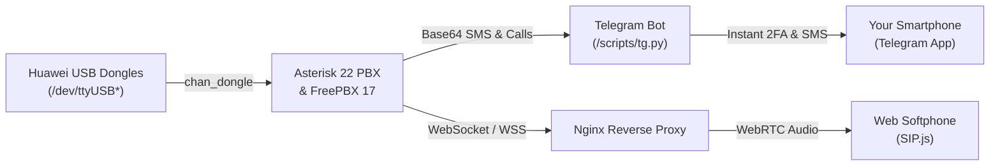

# Software & Server Setup Guide

This guide covers installing and configuring the modern RemoSIM software stack on **Raspbian Bookworm 64-bit / aarch64** (with Asterisk 22 LTS, FreePBX 17, native Opus codec, and WebRTC softphone support).

<div class="callout callout-info">
  <div class="callout-title"><i class="fas fa-history"></i> Legacy Bullseye Documentation</div>
  <p>Looking for the legacy configuration for Debian Bullseye (Asterisk 18 / FreePBX 16)? View our <a href="{{ '/software-bullseye' | relative_url }}">Legacy Bullseye Setup Guide</a>.</p>
</div>

---

## Architecture Overview



---

## Phase 1: Operating System & Dependencies

Flash **Raspberry Pi OS (Bookworm 64-bit)** onto your high-speed microSD card.

### 1.1 Base System Optimization
```bash
sudo apt-get update && sudo apt-get dist-upgrade -y

# Set root password and configure vim
sudo passwd
su

echo "set nocompatible\nset mouse-=a" > /root/.vimrc

# Disable IPv6 if your local network causes VoIP registration delays
echo "net.ipv6.conf.all.disable_ipv6 = 1" >> /etc/sysctl.conf
sysctl -p

# Update /etc/hosts for IPv4 loopback
sed -i 's/::1.*/::1 localhost6 ip6-localhost ip6-loopback/' /etc/hosts
```

### 1.2 Install Build Tools & System Libraries
```bash
# Allow root login via SSH during setup if needed
sed -i 's/#PermitRootLogin prohibit-password/PermitRootLogin yes/' /etc/ssh/sshd_config
systemctl restart sshd

# Install dependencies including chrony for reliable timesync
apt install -y build-essential raspberrypi-kernel-headers apache2 mariadb-server \
  mariadb-client php php-curl php-cli php-mysql php-pear php-gd php-mbstring \
  php-intl php-bcmath curl sox mpg123 lame ffmpeg sqlite3 git unixodbc sudo \
  dirmngr php-ldap nodejs npm pkg-config libicu-dev libncurses5-dev libssl-dev \
  libxml2-dev libnewt-dev libsqlite3-dev automake libtool autoconf unixodbc-dev \
  uuid-dev libasound2-dev libogg-dev libvorbis-dev libcurl4-openssl-dev \
  libical-dev libneon27-dev libsrtp2-dev libspandsp-dev subversion libtool-bin \
  python3-dev unixodbc sendmail-bin sendmail htop cmake libmariadb-dev-compat \
  nload dnsutils vnstat chrony usb-modeswitch uhubctl

# Enable chrony timesync
systemctl enable chrony --now

# Configure MariaDB for FreePBX compatibility
echo "sql_mode=NO_ENGINE_SUBSTITUTION" >> /etc/mysql/mariadb.conf.d/50-server.cnf
systemctl restart mariadb
```

---

## Phase 2: Installing Asterisk 22 LTS with Opus & WebRTC

```bash
cd /usr/src
rm -fr asterisk-22-current.tar.gz
wget http://downloads.asterisk.org/pub/telephony/asterisk/asterisk-22-current.tar.gz
tar xvfz asterisk-22-current.tar.gz
cd asterisk-22.*

contrib/scripts/get_mp3_source.sh
contrib/scripts/install_prereq install

# Configure with bundled pjproject, jansson, and opus for WebRTC support
./configure --with-pjproject-bundled --with-jansson-bundled --with-opus
make menuselect.makeopts
menuselect/menuselect --enable format_mp3 menuselect.makeopts
make -j$(nproc)
make install
make config

# Create the asterisk system user
useradd -m asterisk
chown -R asterisk:asterisk /var/run/asterisk /etc/asterisk /var/{lib,log,spool}/asterisk /usr/lib/asterisk
sed -i 's|#AST_USER|AST_USER|' /etc/default/asterisk
sed -i 's|#AST_GROUP|AST_GROUP|' /etc/default/asterisk
ldconfig

# Configure Apache
rm -rf /var/www/html && mkdir -p /var/www/html
sed -i 's/\(^upload_max_filesize = \).*/\120M/' /etc/php/*/apache2/php.ini
sed -i 's/\(^memory_limit = \).*/\1256M/' /etc/php/*/apache2/php.ini
sed -i 's/^\(User\|Group\).*/\1 asterisk/' /etc/apache2/apache2.conf
sed -i 's/AllowOverride None/AllowOverride All/' /etc/apache2/apache2.conf
a2enmod rewrite
systemctl restart apache2
```

---

## Phase 3: Installing FreePBX 17

```bash
# Install PHP 8.2 and FreePBX 17 dependencies
apt -y install bison flex php8.2 php8.2-curl php8.2-cli php8.2-common php8.2-mysql \
  php8.2-gd php8.2-mbstring php8.2-intl php8.2-xml odbc-mariadb libjansson-dev \
  software-properties-common iptables fail2ban php-soap default-libmysqlclient-dev

# Configure ODBC for MariaDB
cat <<EOF > /etc/odbcinst.ini
[MySQL]
Description = ODBC for MySQL (MariaDB)
Driver = /usr/lib/aarch64-linux-gnu/odbc/libmaodbc.so
FileUsage = 1
EOF

cat <<EOF > /etc/odbc.ini
[MySQL-asteriskcdrdb]
Description = MySQL connection to 'asteriskcdrdb' database
Driver = MySQL
Server = localhost
Database = asteriskcdrdb
Port = 3306
Socket = /var/run/mysqld/mysqld.sock
Option = 3
EOF

# Download and install FreePBX 17
cd /usr/src
wget http://mirror.freepbx.org/modules/packages/freepbx/freepbx-17.0-latest-EDGE.tgz
tar vxfz freepbx-17.0-latest*.tgz
touch /etc/asterisk/{modules,cdr}.conf
cd freepbx
pkill -9 asterisk
./start_asterisk start
./install -n

sed -i 's|;runuser|runuser|' /etc/asterisk/asterisk.conf
sed -i 's|;rungroup|rungroup|' /etc/asterisk/asterisk.conf

fwconsole ma disablerepo commercial
fwconsole ma install callrecording core dashboard customappsreg infoservices logfiles pm2 soundlang sipsettings voicemail
fwconsole reload

# Create systemd startup service with network dependency
cat <<EOF > /etc/systemd/system/freepbx.service
[Unit]
Description=FreePBX VoIP Server
After=mariadb.service network-online.target
Wants=network-online.target

[Service]
Type=oneshot
RemainAfterExit=yes
ExecStart=/usr/sbin/fwconsole start -q
ExecStop=/usr/sbin/fwconsole stop -q

[Install]
WantedBy=multi-user.target
EOF

systemctl daemon-reload
systemctl enable freepbx --now
```

---

## Phase 4: Compiling `asterisk-chan-dongle`

```bash
cd /usr/src
git clone https://github.com/wdoekes/asterisk-chan-dongle.git
cd asterisk-chan-dongle
./bootstrap
./configure --with-astversion=22.1 --with-asterisk=/usr/src/asterisk-22.*/include
make -j$(nproc)
make install

# Grant permissions to asterisk and pi users for modem serial ports
echo 'KERNEL=="ttyUSB*", GROUP="dialout", OWNER="asterisk"' > /etc/udev/rules.d/50-udev-default.rules
usermod -a -G dialout,asterisk pi
chmod 755 /home/pi
udevadm control --reload-rules && udevadm trigger
```

---

## Phase 5: Dongle & Dialplan Configuration

### 5.1 `/etc/asterisk/dongle.conf`
Configure your physical dongles. You can specify modems by explicit TTY device paths or by their unique IMEI number.

```ini
[general]
interval=15             ; Seconds between device reconnect attempts
smsdb=/var/lib/asterisk/smsdb
csmsttl=600

[defaults]
context=dongle-incoming
group=0
rxgain=0
txgain=0
autodeletesms=yes
resetdongle=yes
u2diag=-1
usecallingpres=yes
callingpres=allowed_passed_screen
disablesms=no
language=en
callwaiting=auto
disable=no
initstate=start
exten=+15550100001      ; Fallback incoming DID if carrier hides subscriber number
dtmf=off

; Example: SIM 0 (Assigned to User 0)
[dongle0]
imei=123456789012345    ; Replace with your first dongle's 15-digit IMEI

; Example: SIM 1 (Assigned to User 1)
[dongle1]
imei=987654321098765    ; Replace with your second dongle's 15-digit IMEI
```

### 5.2 `/etc/asterisk/extensions_custom.conf`
Add incoming call and SMS handling rules with **Base64 safe payload transmission**:

```ini
[dongle-incoming]
; Handle Incoming SMS: Append to log and forward base64-encoded payload to Telegram
exten => sms,1,Set(who=${SHELL(/scripts/who.sh ${DONGLENAME})})
exten => sms,n,Set(FILE(/var/log/asterisk/sms.txt,,,al,u)=${STRFTIME(${EPOCH},,%Y-%m-%d %H:%M:%S)} - ${DONGLENAME} - ${CALLERID(num)}: ${BASE64_DECODE(${SMS_BASE64})})
exten => sms,n,System(/scripts/tg.py --sender '${CALLERID(num)}' --dongle '${DONGLENAME}' --destination '${who}' --message-base64 '${SMS_BASE64}')
exten => sms,n,Hangup()

; Handle Incoming USSD Responses (Carrier balance alerts)
exten => ussd,1,Set(ussd_multiline=${BASE64_DECODE(${USSD_BASE64})})
exten => ussd,n,System(echo '${STRFTIME(${EPOCH},,%Y-%m-%d %H:%M:%S)} - ${DONGLENAME}: ${ussd_multiline}' >> /var/log/asterisk/ussd.txt)
exten => ussd,n,Hangup()

; Handle Incoming Calls: Alert on Telegram, then route to extension
exten => _.,1,Set(CALLERID(name)=${CALLERID(num)})
exten => _.,n,GotoIf($["${CHANNEL(state)}" = "Ring"]?call)
exten => _.,n,Goto(from-trunk,${EXTEN},1)
exten => _.,n(call),Set(who=${SHELL(/scripts/who.sh ${DONGLENAME})})
exten => _.,n,System(/scripts/tg.py --sender '${DONGLENAME}' --dongle '${DONGLENAME}' --destination '${who}' --message 'Incoming call from ${CALLERID(num)}')
exten => _.,n,Goto(from-trunk,${EXTEN},1)
```

---

## Phase 6: Automated Telegram Bot (`/scripts/tg.py`)

Create `/scripts/who.sh`:

```bash
mkdir -p /scripts/data /scripts/log
nano /scripts/who.sh
```

```bash
#!/bin/bash
case "$1" in
  dongle0) echo -n "User0" ;;
  dongle1) echo -n "User1" ;;
  *)       echo -n "System" ;;
esac
```
```bash
chmod +x /scripts/who.sh
```

### Deploy `/scripts/tg.py`
Install Python libraries:
```bash
pip3 install -U python-telegram-bot==13.15 PySocks
nano /scripts/tg.py
```

<div class="callout callout-warning">
  <div class="callout-title"><i class="fas fa-shield-alt"></i> Sensitive Data Sanitization</div>
  <p>Fill in your Telegram bot token from <a href="https://t.me/BotFather" target="_blank">@BotFather</a> and your private chat IDs below.</p>
</div>

```python
#!/usr/bin/python3
# -*- coding: utf-8 -*-
"""
RemoSIM Telegram Notification Gateway
Safely handles base64-encoded SMS, USSD, and call events with offline queuing.
"""
import sys
import time
import os
import pickle
import base64
import telegram
from telegram.ext import Defaults
from telegram.utils.request import Request

# Replace with your actual credentials
BOT_TOKEN = "<YOUR_TELEGRAM_BOT_TOKEN>"
ADMIN_CHAT_ID = "<YOUR_ADMIN_CHAT_ID>"

USER_CHATS = {
    "User0": "<YOUR_USER0_CHAT_ID>",
    "User1": "<YOUR_USER1_CHAT_ID>",
    "System": ADMIN_CHAT_ID
}

BLACKLIST = [
    "SPAM_KEYWORD_1",
    "SPAM_KEYWORD_2"
]

def send_telegram_alert(chat_id, text):
    request = Request(connect_timeout=5, read_timeout=8)
    bot = telegram.ext.ExtBot(token=BOT_TOKEN, request=request, defaults=Defaults(timeout=8))
    try:
        bot.send_message(chat_id=chat_id, text=text, parse_mode=telegram.ParseMode.HTML, disable_web_page_preview=True)
    except Exception:
        # Queue message locally if connection is temporarily unavailable
        timestamp = int(time.time() * 1000)
        with open(f"/scripts/data/retry-{timestamp}.pkl", "wb+") as f:
            pickle.dump([chat_id, text], f)

if __name__ == "__main__":
    sender = dongle = dest = "System"
    message = ""

    # Parse command line flags
    for i in range(1, len(sys.argv), 2):
        flag = sys.argv[i]
        val = sys.argv[i + 1] if i + 1 < len(sys.argv) else ""
        if flag == "--sender":
            sender = val
        elif flag == "--dongle":
            dongle = val
        elif flag == "--destination":
            dest = val
        elif flag == "--message":
            message = val
        elif flag == "--message-base64":
            try:
                message = base64.b64decode(val).decode("utf-8")
            except Exception:
                message = val

    if message and not any(bad in message for bad in BLACKLIST):
        target_chat = USER_CHATS.get(dest, ADMIN_CHAT_ID)
        formatted_message = f"📱 <b>SIM ({dongle})</b>\n👤 <b>From:</b> <code>{sender}</code>\n💬 <b>Content:</b>\n{message}"
        send_telegram_alert(target_chat, formatted_message)

    # Process offline queued messages
    import glob
    for queued_file in glob.glob("/scripts/data/retry-*.pkl"):
        try:
            with open(queued_file, "rb") as f:
                saved_chat, saved_text = pickle.load(f)
            send_telegram_alert(saved_chat, saved_text)
            os.remove(queued_file)
        except Exception:
            pass
```

```bash
chmod +x /scripts/tg.py
```

---

## Phase 7: WebRTC, Auto-Healing & Maintenance

### 7.1 WebRTC Reverse Proxy (Nginx)
In your Nginx site configuration (`/etc/nginx/sites-available/default`):

```nginx
location /ws {
    proxy_pass http://127.0.0.1:8088/ws;
    proxy_http_version 1.1;
    proxy_set_header Upgrade $http_upgrade;
    proxy_set_header Connection "upgrade";
    proxy_set_header Host $host;
    proxy_set_header X-Real-IP $remote_addr;
    proxy_set_header X-Forwarded-For $proxy_add_x_forwarded_for;
    proxy_read_timeout 86400s;
    proxy_send_timeout 86400s;
}
```

### 7.2 Modem Auto-Recovery Watchdog (`/scripts/down.sh`)
```bash
#!/bin/bash
numdongles=2
downs=$(asterisk -rx "dongle show devices" | grep "Not connec\|GSM not\|Unknown" | awk '{print $1}')

for d in $downs; do
    asterisk -rx "dongle reset $d"
    /scripts/tg.py --sender "System" --dongle "$d" --destination "System" --message "Dongle $d disconnected and was automatically reset."
done

active=$(lsusb | grep -i "Huawei" | wc -l)
if [ "$active" -lt "$numdongles" ]; then
    /scripts/tg.py --sender "System" --dongle "USB" --destination "System" --message "Dongles missing from USB. Cycling hub power..."
    uhubctl -a cycle -p 1-4
fi
```
```bash
chmod +x /scripts/down.sh
```

### 7.3 Cron Schedules (`crontab -e`)
```cron
* * * * * /scripts/tg.py
*/10 * * * * /scripts/down.sh
0 3 * * * apt-get update && apt-get dist-upgrade -y
```

---

## Next Step: Web Softphone
Place test calls in your browser via our [Web Softphone]({{ '/connect' | relative_url }}) or configure [Mobile Softphones]({{ '/client' | relative_url }}).
